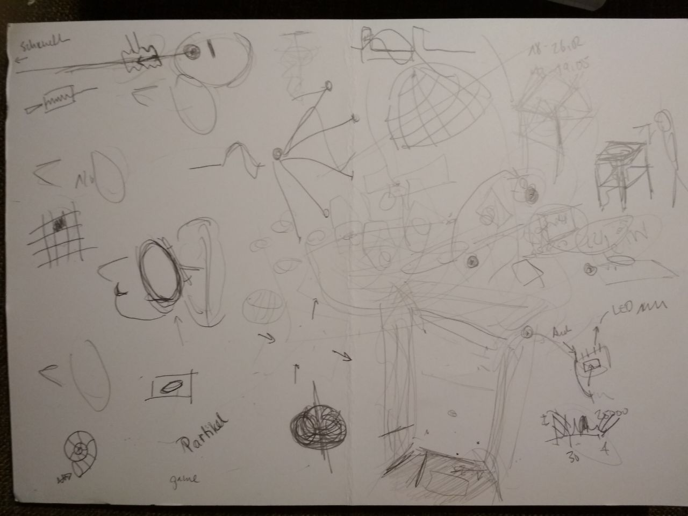

# Cymatics // Fractions

A project in cooperation with [Anda Kryeziu](http://www.andakryeziu.com) and [Justin Robinson](http://justinrobinson.de).

**[Video on YT](https://youtu.be/BeqCDeWwk2w)**

## BHVN Feb2019 - CONCERT

Final setup
* 2 Gigaport HD (8 cinch outputs each)
* 1 Monolith
* 2 15'' speakers with aluminum membrane
* 2 12'' speakers with aluminum membrane
* 3 Amplifiers (2 Standard Audio Amplifiers, 1 Endstufe)
* 5 [LED (strobe) lights, step-up power supply, transistor TIP122, female cinch connected directly to transistor]
* 5 [RGB LED stripes, color control and on/off via arduino nano (audio input via cinch), 12V power supply, arduino USB power supply]
* 2 Fans
* 16 male mono cinch cables
* power supply with 16 plugs
* simple cables for connecting the speakers

### Note (andi) (19/02/19) - AdK Hanseatenweg // PP

We will be located in the "backbox" @ Pariser Platz. There are some discussions about chairs... but we'll fix it (by putting no chairs).

This is our plan:   

We control everything with two external audio cards with 2 x 8 Cinch outputs. Since we need 16 outputs and it was possible to connect both interfaces in MAC audio thing as an "aggregate device" everything is working nicely.
We amplify the signals with two amplifiers and one "endstufe" in the monolith.

Every speaker has its own LED stripe and a stroboscope, which are also controlled via audio (cinch).
This is the flow chart:

### Note (andi) (18/02/2019) - AdK Hanseatenweg

Lots of things were happening.
The full setup includes five speakers, each equipped with an LED strip and a stroboscope.
Audio and lights will all be controlled via the audio interface.
We tested the fans with the stroboscopes. Everything works well. The frequencies of the fans are:
ELTA: high 69Hz, medium 58Hz
\#: slow 49Hz
The ELTA medium configuration also results in some nice colorful effects with a projector.
During the test we destroyed the audio cards of both Macs due to a voltage that we put on it. :(

### Note (andi) (26/01/2019)

Andi ordered the new speakers and did some video recordings with different sound samples.
Now programming of the Arduino for the lights is the main issue. Perhaps I could work with a frequency detection algorithm https://www.arduino.cc/en/Tutorial/SimpleAudioFrequencyMeter
https://dqydj.com/build-your-own-real-time-frequency-analyzer-and-christmas-light-controller/
This is also interesting https://www.instructables.com/id/Arduino-Audio-Input/
I also have to organize the LED light for the second pair of basins.

## Meeting II (andi, anda) (21/01/2019)

We meet in Hardenbergstr. 36 (Projektlabor TU Berlin)
Object: "strobe animated fan"
The rotation of the fan can be controlled via the strobe frequency.
This is a general concept and can be used for even more complex structures that can be animated.  (Example can be seen here: https://youtu.be/ib0g_gmtCcE)
We will use strobe lights for the installation. The Frequency of the strobe will be part of the composition. It will be (presumable) be used for the water basins, but we also want to have fans. We also talked about the black light strobe, could be fun with fluorescin in the starch (but don't touch your eyes!).
We also decided to buy two more speakers, the smaller ones with 12''.
All in all, we will have the monolith (60x60x100cm3, black sculpture with 15'' subwoofer), two other 15'' and two 12'' speakers, which will be sitting somewhere on tables or other big, heavy things.
Andi will take care of building/programming strobe lights, which can alter the strobe frequency depending on an audio signal that is coming in. First I will try to work with impulse functions, than I'll do experiments with other wave forms and "real sound".  
Andi will also order the new pair of 12'' speakers and organize a fan.

Anda does the composition
Andi will try to establish a catalogue of frequencies.

We also talked about Biennale in Munich in 2020.

## Material (05/01/2019)

1. Speakers

    Big 15'' alu membrane subwoofers only available here: http://www.elektro-astra.cz/reproduktor-mega-kick-15-700w-4-o
    Price ~ 100€ / piece
    Alternative: 12'' speakers for ~16€ / piece + 7€ shipping
    https://www.ebay.de/itm/292871036807
    https://www.ebay.de/itm/292871041122

    30€/piece https://www.ebay.de/itm/233025782623

2. LED lightning
    10m RGB LEDs 30€
    https://www.amazon.de/Wasserfestes-LED-Strip-Kit-44-Tasten-Infrarot-Fernbedienung-Weihnachten-Dekoration/dp/B07FY826WX/ref=sr_1_3?ie=UTF8&qid=1546815460&sr=8-3&keywords=LED+streifen+wasserfest+rgb

    Microcontroller Arduino Nano 17€ / 5 pieces https://www.amazon.de/Longruner-ATmega328P-Controller-Module-Arduino/dp/B072LPHG92/ref=sr_1_5?ie=UTF8&qid=1546815609&sr=8-5&keywords=arduino+nano

    Power Supply?

3. Strobe Lights
    High Power LEDs
    white 100W 2.50€ / piece: https://www.amazon.de/SODIAL-Leuchte-Power-Beleuchtung-Warmweiss/dp/B00OVPI0FC/ref=sr_1_31?ie=UTF8&qid=1546816028&sr=8-31&keywords=100w+led
    RGB 50W 4€ / piece
    https://www.amazon.de/SODIAL-Power-Birne-Licht-Strahler/dp/B00M2QGCOI/ref=sr_1_3?ie=UTF8&qid=1546816274&sr=8-3&keywords=high+power+led+rgb

    Power Supply 18€ / piece
    https://www.amazon.de/UIOTEC-Converter-Digital-controlled-Stabilizers-Regulator/dp/B07F28NGWB/ref=sr_1_22?ie=UTF8&qid=1546815820&sr=8-22&keywords=step+up+power+supply

## Meeting I  15/11/2018 (andi, anda, justin)
More Basins, more lights
Particle animations *on the floor *on the wall
Stroboscopes on the Basins *sync to sound -> How?
3D domes are awesome

